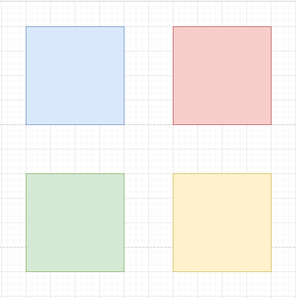
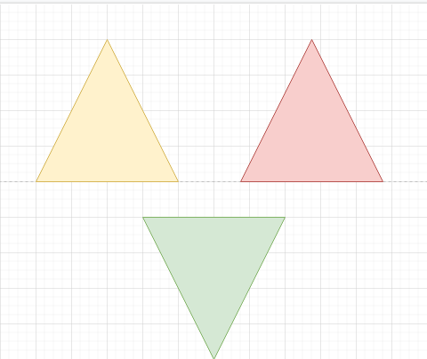
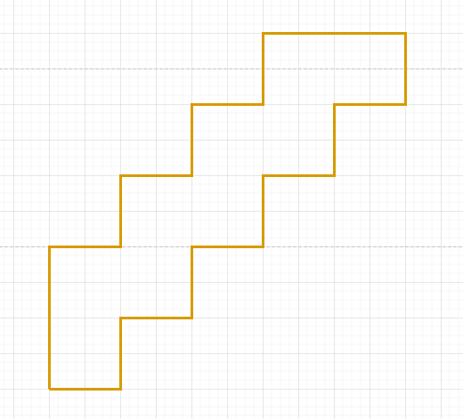
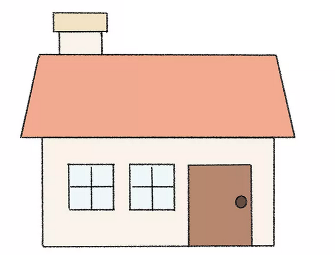

# Turtle

## Oefening 1

Maak onderstaande tekening na.

## Oefening 2

Maak onderstaande tekening na.

## Oefening 3

Maak onderstaande tekening na.

## Oefening 4

Maak een huis

Maak onderstaande tekening na.

## Oefening 5

Zoek op het internet naar turtle python scripts.
