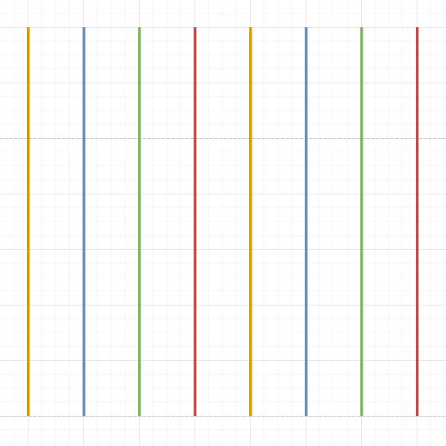
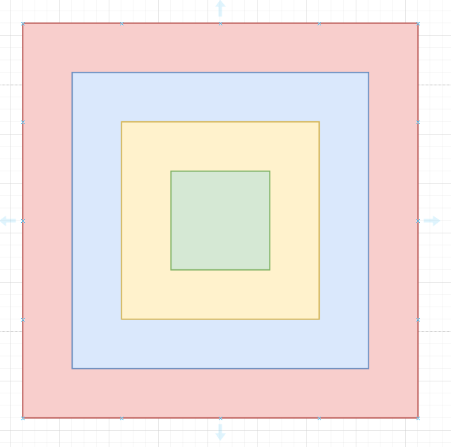

# Lijsten

## Oefening 1

Zoek het grootste getal in de lijst. Print dit getal.

```python
lijst = [-85, 37, 31, -64, -25, 52, 29, 30, -95, 9, 4, -37, -87, 22, -67, -42, 46, 21, -29, 73, -39, 61, 97, 30, -65, 79, 90, -90, -78, 40, 34, -13, -76, -48, 47, -7, -9, -19, 7, -77, -71, 74, 14, 89, 41, -54, 29, 81, -21, -73, -47, -98, -45, -54, 72, 11, 36, 53, -62, 71, -40, -49, -5, -4, -52, -80, -93, -33, -65, 81, 44, -2, -79, -85, -65, -45, -65, 35, -97, 29, 13, 93, 17, 18, 84, 11, -21, -68, -85, 31, 48, 60, 46, 30, -95, 64, 64, 38, -97, 88]

# Code...
```

## Oefening 2

Zoek het kleinste getal in de lijst. Print dit getal.

```python
lijst = [76, -69, -39, -100, -25, -15, -49, 68, -15, 67, 80, 93, -38, 10, 43, 81, 83, 98, -15, -96, 78, -4, 78, 72, -30, 32, -18, 17, 83, -33, 59, -12, -9, -17, 50, 11, 33, -47, -82, 14, 60, 20, -44, 62, -3, 22, 71, 0, 37, 37, 69, 81, -69, -75, 10, -82, 65, -72, -32, 57, 84, 1, -24, 47, 84, 50, 73, 13, 24, -42, -44, -34, 56, -6, -80, 84, 73, 37, 81, 8, 54, -2, 73, 40, -91, 23, -26, 83, 96, -46, -46, 73, -98, -21, 81, -90, 81, 1, 54, -7]

# Code...
```

## Oefening 3

Zoek het grootste verschil tussen twee getallen in de lijst. Dit is het verschil tussen het grootste en het kleinste getal.

```python
lijst = [41, -1, 75, 76, 41, -21, -65, 66, 77, -32, 55, 12, 11, -33, -42, -66, 19, -15, -34, -96, 97, 78, 49, 94, 37, -35, 53, 23, 77, 8, -91, -70, -9, 11, -16, 75, -34, 54, -67, 63, 35, -2, 74, 9, 5, 9, -71, 71, -27, -48, 32, 87, -99, 30, 5, -59, 92, -61, -93, -61, -8, 54, 27, -56, 79, 12, -6, -21, 66, 37, 54, 44, 79, -90, -46, 37, 4, -28, 84, -58, 76, -62, 29, -20, -82, 43, -88, -90, -52, -18, -40, 94, 51, -34, -100, 5, -23, -89, 50, -5]

# Code...
```

## Oefening 4

Maak een lijst met alle negatieve getallen in de gegeven lijst. Print deze lijst. Print ook hoeveel negatieve getallen er zijn.

```python
lijst = [-54, -81, 53, -93, -11, -15, 49, -54, 2, 89, 39, 88, -18, 60, -94, -38, 14, -21, -23, -48, 96, -67, -17, -57, 15, 34, -49, 23, -26, 61, 42, 48, -17, 51, -44, -19, 20, -6, 20, 88, -70, -71, 68, 20, 48, -77, 7, -29, 74, -64, -26, -34, 46, 19, 32, -6, -19, -35, -11, -35, 11, 72, 18, 1, -9, -29, -19, 97, -3, 73, 61, 96, -62, -33, -7, 15, -15, -67, 59, -52, 67, -97, 55, 67, -30, -8, 77, -26, -14, 34, 80, -45, 47, 9, 48, -79, -89, -64, -83, -79]

# Code...
```

## Oefening 5

Zoek het aantal negative, poitieve, even en oneven getallen in de gegeven lijst. Print deze aantallen.

```python
lijst = [2, 16, -26, -68, -88, -37, -5, -63, -67, -62, 48, 70, 21, 99, -58, -65, 89, -13, 73, -25, 72, -60, -92, -85, -53, 52, 34, 15, 23, 56, -33, -28, -70, 56, -18, 84, 28, -41, 24, -65, 25, -17, 41, -71, 87, 62, -7, 30, 3, 21, -27, -51, -21, -88, -4, -8, -97, -34, 39, 64, -64, -90, 65, -44, -16, 28, -61, -15, 43, -99, -83, 83, 25, -29, -80, -91, 91, -47, -24, 64, 76, 39, 9, -5, 91, 23, -33, 89, 98, -73, -40, 70, 56, -1, -41, 91, 56, -71, -65, -80]

# Code...
```

## Oefening 6

Turtle. Maak onderstaande tekening na. Maak gebruik van een **for loop**!



## Oefening 7

Turtle. Maak onderstaande tekening na. Maak gebruik van een **for loop in een for loop**!


